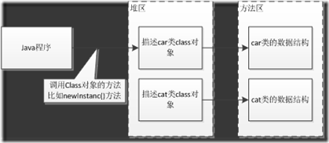
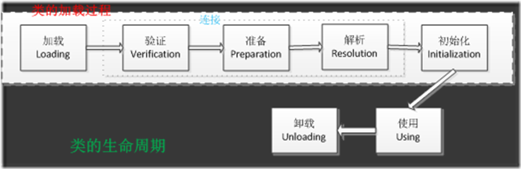
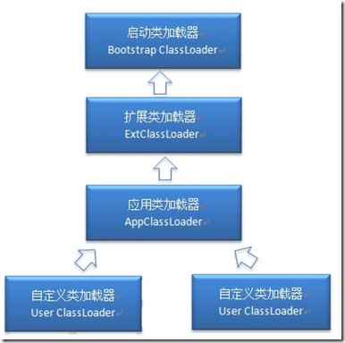
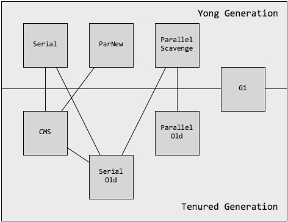

# 深入理解JVM笔记
* 目录
 
 ## 一、类加载机制
### 1.1 概述
    虚拟机把描述类的数据从Class文件加载到内存， 并对数据进行校验、 转换解析和初始化， 最终形成可以被虚拟机直接使用的Java类型， 这就是虚拟机的类加载机制。
### 1.2 什么是类的加载
    类的加载指的是将类的.class文件中的二进制数据读入到内存中，将其放在运行时数据区的方法区内，然后在堆区创建一个java.lang.Class对象，用来封装类在方法区内的数据结构。类的加载的最终产品是位于堆区中的Class对象，Class对象封装了类在方法区内的数据结构，并且向Java程序员提供了访问方法区内的数据结构的接口。

### 1.4 加载.class文件的方式
* 从本地系统中直接加载
* 从网络上下载.class文件
* 从zip、jar等归档文件中加载.class文件
* 从专有数据库中提取.class文件
* 将java源文件动态编译为.class文件
### 1.5 类的声明周期

其中类加载的过程包括了加载、验证、准备、解析、初始化五个阶段。在这五个阶段中，加载、验证、准备和初始化这四个阶段发生的顺序是确定的，而解析阶段则不一定，它在某些情况下可以在初始化阶段之后开始，这是为了支持Java语言的运行时绑定（也成为动态绑定或晚期绑定）。另外注意这里的几个阶段是按顺序开始，而不是按顺序进行或完成，因为这些阶段通常都是互相交叉地混合进行的，通常在一个阶段执行的过程中调用或激活另一个阶段。
### 1.6 类的加载、连接和初始化
 - 加载:查找并加载类的二进制数据

&nbsp;&nbsp;&nbsp;&nbsp;加载时类加载过程的第一个阶段，在加载阶段，虚拟机需要完成以下三件事情：

    1、通过一个类的全限定名来获取其定义的二进制字节流。
    2、将这个字节流所代表的静态存储结构转化为方法区的运行时数据结构。
    3、在Java堆中生成一个代表这个类的java.lang.Class对象，作为对方法区中这些数据的访问入口。
 - 连接：
    * 验证：确保被加载的类的正确性
    ```文件格式验证：验证字节流是否符合Class文件格式的规范；例如：是否以0xCAFEBABE开头、主次版本号是否在当前虚拟机的处理范围之内、常量池中的常量是否有不被支持的类型。
    元数据验证：对字节码描述的信息进行语义分析（注意：对比javac编译阶段的语义分析），以保证其描述的信息符合Java语言规范的要求；例如：这个类是否有父类，除了java.lang.Object之外。
    字节码验证：通过数据流和控制流分析，确定程序语义是合法的、符合逻辑的。
    符号引用验证：确保解析动作能正确执行。
   ```
    * 准备：为类的静态变量分配内存，并将其初始化为默认值
    ```
    1、这时候进行内存分配的仅包括类变量（static），而不包括实例变量，实例变量会在对象实例化时随着对象一块分配在Java堆中。
    2、这里所设置的初始值通常情况下是数据类型默认的零值（如0、0L、null、false等），而不是被在Java代码中被显式地赋予的值。
   ```
    * 解析：把类常量池中的符号引用转换为直接引用
    ```
   解析阶段是虚拟机将常量池内的符号引用替换为直接引用的过程，解析动作主要针对类或接口、字段、类方法、接口方法、方法类型、方法句柄和调用点限定符7类符号引用进行。符号引用就是一组符号来描述目标，可以是任何字面量。
   直接引用就是直接指向目标的指针、相对偏移量或一个间接定位到目标的句柄。
   ```
  - 初始化：为类的静态变量赋予正确的初始值
  ```
    初始化，为类的静态变量赋予正确的初始值，JVM负责对类进行初始化，主要对类变量进行初始化。在Java中对类变量进行初始值设定有两种方式：
    ①声明类变量是指定初始值
    ②使用静态代码块为类变量指定初始值
    JVM初始化步骤
    1、假如这个类还没有被加载和连接，则程序先加载并连接该类
    2、假如该类的直接父类还没有被初始化，则先初始化其直接父类
    3、假如类中有初始化语句，则系统依次执行这些初始化语句
```
- 类的初始化时机：所有的Java虚拟机实现必须在每个类或接口被Java程序**“首次主动使用”**时才会对类进行初始化
 - Java程序对于类的使用方式分为两种
     * -主动使用
     * -被动使用
 - 类的主动使用有七种方式
    * -创建类的实例（new一个对象）
    * -访问某个类或接口的静态变量，或者对静态变量赋值(对应字节码get_static、put_static)
    * -调用类的静态方法(对应字节码invoke_static)
    * -反射(如Class.forName("com.macky.Test"))
    * -初始化一个类的子类
    * -Java虚拟机启动时被标明为启动类的类(main方法、Java Test)
    * -JDK1.7开始提供的动态语言支持：Java.lang.invoke.MethodHandle实例的解析结果REF_getStatic、REF_putStatic、REF_invokeStatic句柄对应的类没有初始化，则初始化
 ### 1.7 虚拟机结束生命周期的情况
 * 程序正常执行结束
 * 程序执行了System.exit()方法
 * 程序在执行过程中遇见异常或者错误而终止
 * 操作系统错误导致Java虚拟机退出
 ### 1.8 类加载器
 
 
 **注意：这里父类加载器并不是通过继承关系来实现的，而是采用组合实现的。**
 * 启动类加载器：Bootstrap ClassLoader，负责加载存放在JDK\jre\lib(JDK代表JDK的安装目录，下同)下，或被-Xbootclasspath参数指定的路径中的，并且能被虚拟机识别的类库（如rt.jar
 ，所有的java.*开头的类均被Bootstrap ClassLoader加载）。启动类加载器是无法被Java程序直接引用的。
 * 扩展类加载器：Extension ClassLoader，该加载器由sun.misc.Launcher$ExtClassLoader实现，它负责加载DK\jre\lib\ext目录中，或者由java.ext.dirs
 系统变量指定的路径中的所有类库（如javax.*开头的类），开发者可以直接使用扩展类加载器。
 * 应用程序类加载器：Application ClassLoader，该类加载器由sun.misc.Launcher$AppClassLoader来实现，它负责加载用户类路径（ClassPath
 ）所指定的类，开发者可以直接使用该类加载器，如果应用程序中没有自定义过自己的类加载器，一般情况下这个就是程序中默认的类加载器。
### 1.9 类加载机制特性
 * 全盘负责，当一个类加载器负责加载某个Class时，该Class所依赖的和引用的其他Class也将由该类加载器负责载入，除非显示使用另外一个类加载器来载入
 * 父类委托，先让父类加载器试图加载该类，只有在父类加载器无法加载该类时才尝试从自己的类路径中加载该类
 * 缓存机制，缓存机制将会保证所有加载过的Class都会被缓存，当程序中需要使用某个Class时，类加载器先从缓存区寻找该Class，只有缓存区不存在，系统才会读取该类对应的二进制数据，并将其转换成Class
 对象，存入缓存区。这就是为什么修改了Class后，必须重启JVM，程序的修改才会生效
### 1.10 双亲委派模型
* 双亲委派模型的工作流程是：如果一个类加载器收到了类加载的请求，它首先不会自己去尝试加载这个类，而是把请求委托给父加载器去完成，依次向上，因此，所有的类加载请求最终都应该被传递到顶层的启动类加载器中，只有当父加载器在它的搜索范围中没有找到所需的类时，即无法完成该加载，子加载器才会尝试自己去加载该类。
* 双亲委派机制:
   * 1、当AppClassLoader加载一个class时，它首先不会自己去尝试加载这个类，而是把类加载请求委派给父类加载器ExtClassLoader去完成。
   * 2、当ExtClassLoader加载一个class时，它首先也不会自己去尝试加载这个类，而是把类加载请求委派给BootStrapClassLoader去完成。
   * 3、如果BootStrapClassLoader加载失败（例如在$JAVA_HOME/jre/lib里未查找到该class），会使用ExtClassLoader来尝试加载；
   * 4、若ExtClassLoader也加载失败，则会使用AppClassLoader来加载，如果AppClassLoader也加载失败，则会报出异常ClassNotFoundException。
* 双亲委派模型意义：

    - 系统类防止内存中出现多份同样的字节码
    - 保证Java程序安全稳定运行
## 四、垃圾收集器
### 4.1 概览图

### 4.4 G1垃圾收集器

Oracle官方文档：https://www.oracle.com/technetwork/tutorials/tutorials-1876574.html
* **响应能力**：响应能力是指应用程序或系统对请求的数据做出响应的速度。
    * 对事件的响应速度
    * 网站返回一个页面的速度
    * 数据库返回一个查询的速度
* **吞吐量**：吞吐量专注于最大程度地提高应用程序在特定时间段内的工作量。
    * 在给定时间内完成的事务数
    * 批处理程序在一小时内可以完成的工作数
    * 一小时内可以完成的数据库查询数
* 特点
    * 和CMS垃圾收集器一样都支持和应用程序线程并发操作
    * 不会长时间的停顿去进行空闲空间的整理
    * 需要更多可预测的GC暂停时间
    * 不会对吞吐量造成影响
    * 不需要更大的堆空间
#### 4.1 G1的堆分配方式

    